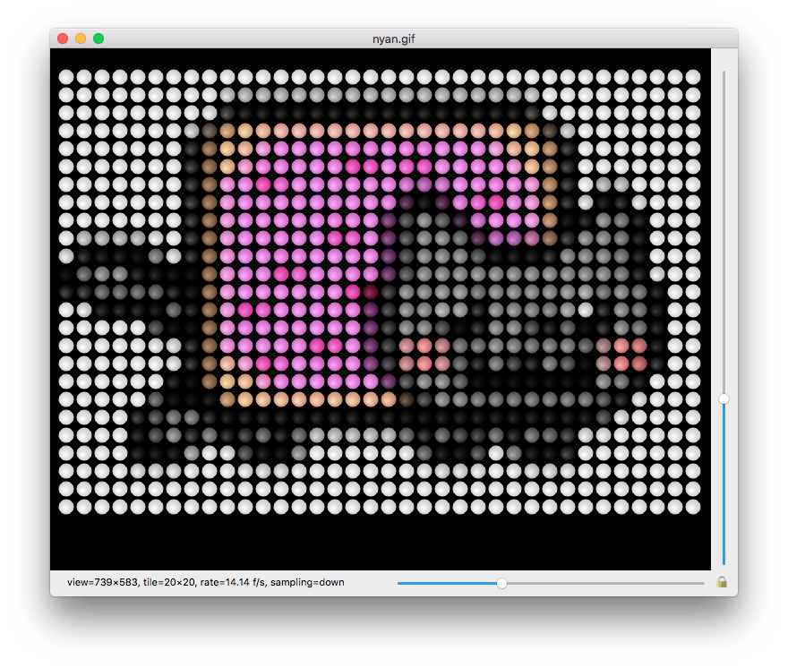

_Spirited Array_ is a Mac application for de-pixelating and then whimsically re-pixelating animated GIF's. Inspired by the nightly Electrical Water Pageant on the Seven Seas Lagoon at Walt Disney World, Spirited Array was written to simulate light board animations of unspecified dimension, without expensive hardware.

# Requirements

As of v1.0.3, Spirited Array is now a universal binary for both Intel and Apple Silicon macs. Additionally, it also now requires macOS 11 or later.

v1.0.2 will run on macOS versions as old as 10.7 and at least as new as 15.1.

# Operation

To operate, open the Application on your Mac and choose _Open_ from the _File_ pull-down menu. Then, navigate to and select an animated GIF, static GIF, (static) PNG or (static) TIFF file.

An attempt will be made to recognize any pixelation your file exhibits, and remove it. Finally, your animation will be re-pixelated according to the configured tiling strategy, and animated in a loop. Details about your animation will be provided in a status bar at the lower left-hand corner of the animation window.

|  | 
|:--:| 
| _screenshot of animation processed from prguitarman's "Pop Tart Cat" GIF (popularized as "Nyan Cat" in a video by saraj00n.)_ |

You may choose different tiling strategies with the _Tiling_ pull-down menu.

To change the dimensions of the virtual array, simply resize the animation window.

Use the linked sliders that appear after processing to change the tile size and restart the de-pixelation and re-pixelation sequence.

By default, the vertical and horizontal sliders will be locked together. You can toggle locking on and off by clicking on the padlock icon in the lower right-hand corner of the animation window.

To export re-pixelated video to a file, use the appropriate Export corresponding to the desired output format under the _File_ Menu. The choices are QuickTime movie, MP4 video, and Animated GIF.

GIF Exports are currently limited to animations that exhibit 256 or fewer distinct colors. Also, be advised that large frames and long durations can result in truly enormous output GIF file sizes.

# Building from Source

_Spirited Array_ is licensed under GPL v3.0 and available to clone [on github](https://github.com/dhorlick/spirited_array).

The project should build directly in XCode 16 (and probably other versions, too.)

_Spirited Array_ makes use of idiosyncratically but permissively-licensed [libgif-5.2.2](https://sourceforge.net/projects/giflib/). To keep things simple, actual binaries are included. But feel free to compile libgif yourself, and replace `lib/libgif.a` and `lib/libgif-i386/a`.

